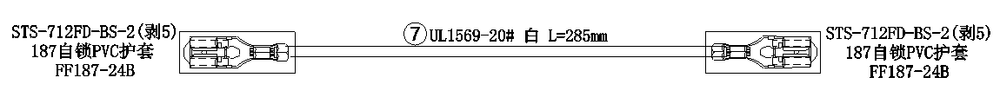
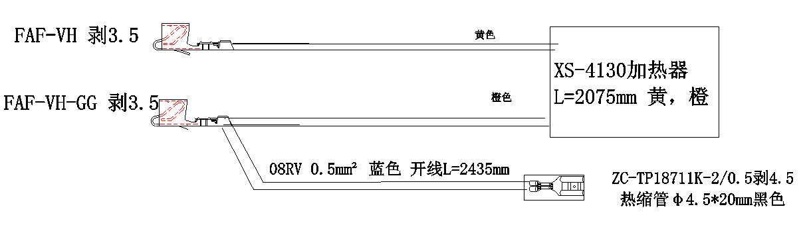
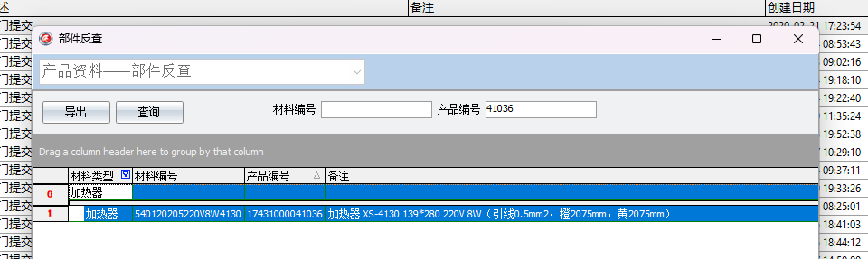

<h1 align=center>做了什么，学到了什么，有什么思考</h1>

<strong style="font-size: 30px;">目录</strong>

- [1. 基本常识](#1-基本常识)
  - [1.1. 公司的定位](#11-公司的定位)
  - [1.2. 对线束用途的理解](#12-对线束用途的理解)
  - [1.3. 线束是怎么生产出来的（BOM 与工艺路线角度）](#13-线束是怎么生产出来的bom-与工艺路线角度)
    - [1.3.1. 检验的哲学](#131-检验的哲学)
    - [1.3.2. 开线与压着](#132-开线与压着)
      - [1.3.2.1. 开线-工艺概述](#1321-开线-工艺概述)
      - [1.3.2.2. 压着-工艺概述](#1322-压着-工艺概述)
      - [1.3.2.3. 案例 1：常规纯电线（19158#为例）](#1323-案例-1常规纯电线19158为例)
      - [1.3.2.4. 案例 2：带加热板的电线（41036#为例）](#1324-案例-2带加热板的电线41036为例)
      - [1.3.2.5. 实际生产](#1325-实际生产)
      - [1.3.2.6. 实际检验](#1326-实际检验)
    - [1.3.3. 装配与扎板](#133-装配与扎板)
      - [1.3.3.1. 装配-工艺概述](#1331-装配-工艺概述)
      - [1.3.3.2. 扎板-工艺概述](#1332-扎板-工艺概述)
      - [1.3.3.3. 实际生产](#1333-实际生产)
    - [1.3.4. 成品检验](#134-成品检验)
- [2. 打杂](#2-打杂)
  - [2.1. 常规打杂](#21-常规打杂)
    - [2.1.1. 招工](#211-招工)
    - [2.1.2. 接待新人办理入职](#212-接待新人办理入职)
    - [2.1.3. 装货、卸货、拉货](#213-装货卸货拉货)
    - [2.1.4. 点数、追货](#214-点数追货)
    - [2.1.5. 拆卸、组装手推车](#215-拆卸组装手推车)
    - [2.1.6. 拔钉子](#216-拔钉子)
    - [2.1.7. 装插座](#217-装插座)
    - [2.1.8. 在二戒所教别人上板](#218-在二戒所教别人上板)
  - [2.2. 电子打杂](#22-电子打杂)
    - [2.2.1. 维修全公司网络瘫痪的问题](#221-维修全公司网络瘫痪的问题)
    - [2.2.2. 为女子所制造线束教学视频](#222-为女子所制造线束教学视频)
    - [2.2.3. 人脸门禁](#223-人脸门禁)
    - [2.2.4. 打印机](#224-打印机)
    - [2.2.5. ERP](#225-erp)
    - [2.2.6. FMS](#226-fms)
    - [2.2.7. 维修电脑](#227-维修电脑)
    - [2.2.8. 培训操作电脑](#228-培训操作电脑)
    - [2.2.9. 安装 WIFI](#229-安装-wifi)
  - [2.3. 专业相关\[未写\]](#23-专业相关未写)
- [3. 专业相关企业信息化的思考\[未写\]](#3-专业相关企业信息化的思考未写)
- [4. 社会阅历\[未写\]](#4-社会阅历未写)

# 1. 基本常识

> 🙏 前言：这些都是我实际参与生产时总结的经验，我经验不足，因此总结得可能不够深刻和准确，同时我个人风格喜欢用大白话来说，思维有点发散，因此尽管我行文上谨慎，写作上可能还会有较多的冗余，我已经尽力保证文章的可读性了。如有纰漏，敬请指正！

## 1.1. 公司的定位

相比于勤帆德，顺合德属于利昌的`生产型子公司`，核心职能是**替总公司生产产品**，类似于生产车间，依赖于总公司所提供的资源：

- 生产资料
  - 原材料、生产设备、端子模具、生产图纸、软件等……
- 生产经验工
- ……

相对于总公司**缺失部分职能**：

1. 没有销售部门
   - 不能与客户对接而产生订单，**没有自己的客户**
2. 不完整的采购部门
   - 虽然没有销售部门，但是能够拿到总厂销售部门流转的订单，即**承接总公司部分订单**
   - 分析订单得出采购需求后，供应商不是外部企业而是总公司，即**向总公司请购物料**
3. 没有技术部门
   - 依赖总公司技术部门将客户的**技术图纸转换成生产图纸**
4. 不完整的财务部门
   - 业务进行需要**向总公司申请资金**
5. ……

但是某些职能**具有自主权**：

1. 人事部门
   - 员工招聘
   - 人员安排
   - 计算工时
   - ……
2. 生产部门
   - 生产计划
   - 生产执行
   - 生产管理
   - ……
3. ……

> 站在总厂的角度用大白话来说就是：“我分一些订单给你，然后你告诉我你要什么材料，找我要，我送到你这。后面不管你怎么安排，你只要给我按质按量完成生产，然后送回我这。如果可以也可以替我将货送到就近客户手里。”

> 💡 个人理解：顺合德的建厂目的是方便利用三水区及周边的戒毒所、监狱的**廉价且丰富的劳动力资源**以提高总厂的生产力，其次是方便给就近的客户送货（例如南海美的）。

## 1.2. 对线束用途的理解

> 前言：我对机械、电气的知识相当的缺乏，关于我对线束的理解，我使用我自己的专业知识，也就是软件开发的相关知识进行类比。

- 电气系统与软件系统类似，同样为**组件化开发、提高系统可维护性和灵活性**等……目的，对系统进行**模块化**
- 各个模块之间进行**通信**，形成一个整体，用于实现系统的功能
- 电器系统中的各个模块之间的通信是通过各种`电线`完成的
- 但是其模块以及模块间的关系多且繁杂，对应会导致`电线`也数量多且繁杂
- 因此需要对各种`电线`进行整理、整合
- 这些`电线`组成的整体应该能被称为`线束`了

> 据我了解，公司所涉及到的电器产品的种类是冰箱、洗衣机、微波炉、洗碗机等……。当然，线束也可以用于汽车；总之线束的适用的范围特别的广，凡是涉及到电气系统的一般都能适用。

## 1.3. 线束是怎么生产出来的（BOM 与工艺路线角度）

> ⚠ 大前提：<u><mark>**线束的生产严格按照生产图纸的指导进行**<mark></u>

线束生产的工艺路线是：

$$开线→压着→装配→扎板$$
其中`检验`工序穿插在各个工艺间，包含`首检`、`巡检`、`全检`等。

### 1.3.1. 检验的哲学

这里我想首先聊一下检验的哲学：

- 发布一个任务，让人或者机器重复去做，都不一定能够完全按照既定的要求去完成，因此需要监督。
- 只是说机器相对来说靠谱一点。
  > 这就是为什么我想要把**检验**放到第一位来描述，我认为人的不稳定性会更高；相对软件生产而言，这个概念对于制造业生产更重要。
- 更何况，生产的最理想的目标就是十全十美，任务的执行完全合乎预期，但是事实是不可能，不过还是会奢望。
- 最理想的情况下靠谱的**监督策略**是在任务进行时**实时监管**，但耗费大量的人力和资源。
- 性价比最高的**监督策略**，是定期检查：
  - <a id="first">检查任务首次的完成情况。毕竟俗话说得好，**“方向错了，一切努力都是徒劳”**。</a>
  - <a id="after">之后定期检查任务的完成情况。保证任务执行的稳定性，也就是**不让努力的方向走偏**。</a>

<a id="check_template">因此我认为`检验`工序在制造业中有个通用模板，即`首检`配合`巡检`用于**监督生产**：</a>

> 当然，生产员自身也需要履行**自检**的责任。

1. **首检**。对应[<u>前文</u>](#first)所说的`检查任务首次的完成情况`。
2. **巡检**。对应[<u>前文</u>](#after)所说的`定期检查任务的完成情况`。

以上所说的本质上依然是抽检，更多的作用是保证**生产的稳定性**。

如果需要进一步保证产品的质量，就需要对所生产的产品进行**全数检查**，即`全检`。

不过这比生产时的**实时监督**节省资源且靠谱，毕竟任务的执行很**集中**。

### 1.3.2. 开线与压着

- 相关物料：
  - 电线
    - 👉 说明：电线除了**纯电线**外，还可以**自带功能模块**，如`加热片`、`传感器`等
  - 端子

#### 1.3.2.1. 开线-工艺概述

1. 对图纸：根据`生产图纸`的要求
2. 裁剪：将**指定规格**的`电线`切割成**指定长度**
3. 剥口：剥去`电线端点`**指定长度**的绝缘层，使内部导线**暴露**

#### 1.3.2.2. 压着-工艺概述

1. 对图纸：根据`生产图纸`的要求
2. 压接：将**指定规格**的`端子`，**机械性**地安装到已`剥口`的`电线端点`上，使之与`电线`内部导线**连接**
   - 👉 说明：端子不一定只与一根电线相连 - 如果压接的端子只与一根电线相连称为**单打** - 如果压接的端子只与多根电线相连称为**并打**
     > 🤔 题外话：使端子与导线连接的方式除了`压接`，还有`焊接`等……

#### 1.3.2.3. 案例 1：常规纯电线（19158#为例）

  
   
  
    图1. 19158#生产图纸节选
  

- 电线的规格：
  - `UL1569-20#`表示的是电线的`型号`
  - `白`表示的是电线的`颜色`
- 开线工艺的操作指标：
  - `L=285mm`表示的是电线的`裁剪长度`为**285mm**
  - `剥5`表示的是电线端点的`剥口长度`为**5mm**
- 端子的规格：
  - `STS-712FD-BS-2`表示的是端子的`型号`
- 压着工艺的操作指标：
  - 图中的端子均连接一根电线，因此端子是`单打`的
- 护套的规格：
  - `FF187-24B`表示的是与`STS-712FD-BS-2`端子配套的护套的`型号`

#### 1.3.2.4. 案例 2：带加热板的电线（41036#为例）

  
   
  
    图2. 41036#生产图纸节选
  

> 由于图示的加热器信息我个人认为还不明确，因此进入`FMS系统`查询加热器的全称信息：
>
> 1. 登录 FMS 系统-报表-产品资料-部件反查
> 2. 在部件反查窗口中，在`产品编号`对应的文本框，输入 41036
> 3. 在过滤器行即`第0行`中，`材料类型`列输入<u>加热</u>，并搜索
> 4. 如图所示，得到 1 条数据，即为对应生产图纸中加热器的信息，全称为`加热器 XS-4130 139*280 220V 8W（引线0.5mm²，橙2075mm，黄2075mm）`
>
> 

- `XS-41036`为加热器的`型号`
- 结合 FMS 查询信息，`L=2075mm 黄，橙`表示的是 2 条引线的颜色分别为
  橙色
  和
  黄色，
  线长均为**2075mm**

> 这些自带功能模块的电线，一般由供应商剥口，来料时就已经完成剥口了

- 橙色引线

  - 端点`剥口长度`为**3.5mm**
  - 端子型号为`FAF-VH`
  - `单打`连接

- 黄色引线
  - 端点`剥口长度`为**3.5mm**
  - 端子型号为`FAF-VH-GG`
  - `并打`连接
- 并打
  黄色
  引线的
  蓝线
  - `L=2075mm`表示的是电线的`裁剪长度`为**2435mm**
  - `并打`连接`FAF-VH-GG`端子的电线端点`剥口长度`为**3.5mm**
  - `单打`连接`ZC-TP18711K-2/0.5`端子的电线端点`剥口长度`为**4.5mm**
  - `ZC-TP18711K-2/0.5`端子被**热缩管**包裹
  - `Φ4.5*20mm黑色`指的是热缩管的`直径`为**4.5mm**，`长度`为**20mm**，`颜色`为**黑色**
  - `RV`指的是电线的`型号`

#### 1.3.2.5. 实际生产

顺合德在`开线与压着`工艺实际生产使用机器，机器分为`全自动端子压着机`和`半自动端子压着机`

> 🙏 前言：我只能说个大概，更详细的内容要参考`作业指导书`

> ⚠ 注意：机器生产具有一定的危险性，需要严格按照`作业指导书`规范操作，<u>**安全第一**</u>！

> 📖 笔记：每种端子都需要有匹配的模具进行`压着`工艺

1. 全自动端子压着机

   - 生产功能：
     - 机器能够一次性完成`开线`、`压着`、`上护套`等工序
     - 双头自动端子机
       - 打端子既可以`单打`也可以`并打`
     - 单头自动端子机
       - 打端子只能`单打`
   - 操作流程：
     - 接收任务，当前机器的**生产任务**被`产品标识单`标识
     - 开机时，会有`机修人员`设定任务并调整机器参数，`检验人员`或`生产组长`**抽取首批生产样品**进行**检验**，**检验**通过后方可**继续后续生产**，否则直至机器调整正确为止
     - 每批产品生产完成之间会有**休眠时间**，趁这段时间**整理**生产的一批产品，顺便**检查**是否存在不良品，然后**包扎**后放入收纳箱中，等待下一批产品的生产
     - 生产过程中定时会有`检验人员`抽取样品进行**检验**
     - 当机器出现问题时，如果不能自行解决，需要呼叫`机修人员`进行调整
       > 一般情况出现的问题都是小问题，例如补料、端子卡轨、线折叠错乱、护套卡轨等……，这些需要操作员**尽量自行解决**

2. 半自动端子压着机

   > 我在实际参与生产时没有`并打`的操作经历，只知道大概手法：
   >
   > - 对于**不同粗细的线**的手法是，细线在下粗线在上
   > - 对于**相同粗细的线**的手法是，两线水平并排摆放

   - 生产功能：
     - 机器只能进行`压着`工艺，因此操作前需要对线`剥口`
     - 打端子既可以`单打`也可以`并打`
   - 操作手法：
     - 握线手指与准`压接`的电线端点**保持一定距离**
     - 将准`压接`的电线端点，对准工作区**挡板**中间，并与之**轻轻接触**
     - 并与挡板所在平面垂直，且与水平面形成 30° 的夹角（**向下倾斜**）
     - **线开口处**对准**压接位**，**绝缘层**对准**压胶位**
     - 完成**定位**后，踩下脚踏板，**执行操作**
   - 操作员操作流程：
     - 按照生产任务以及作业指导书规范进行操作
     - `检验人员`或`生产组长`**抽取首批生产样品**进行**检验**，**检验**通过后方可**继续后续生产**，否则直至整改正确为止
     - 生产过程中定时会有`检验人员`抽取样品进行**检验**

#### 1.3.2.6. 实际检验

> ⚠ 检验在生产中的含义：检验就是使用某种手段（工具、仪器等）检查物料（包括原料、半成品、成品）是否符合特定的标准，确定物料是否适合下一道工序或者交付客户。

- [<u>1.3.2.5. 实际生产</u>](#1325-实际生产)章节所提到的机器操作的检验，都符合前文所提到的[<u>检验模板</u>](#check_template)。
- 同时操作员也执行部分检验任务，即`自检`。
- 那在`开线与压着`工艺中，具体的检验内容是什么呢？

  - 外观检查：
    - 检查生产的产品是否符合`产品标识单`或`生产图纸`的要求，例如**电线的规格**、**端子的规格**、**开线长度**、**剥口长度**等
    - 端子的压接是否良好，例如`不到位`、`包胶`、`飞丝`、`漏打`、`断导线`、`端子变形`、`端子切伤`等
  - 端子连接力检查：
    - 检查生产的产品的端子的`铆接力`与`插拔力`。

- 既然有检验内容，就有**检验指标**来对照判定产品质量是否合格

  端子外观图
   
  连接力对照表

<!-- 外观检查中的对图纸其实可以不用赘述，毕竟前文提到看图纸的内容 -->
<!-- 端子的外观检查指标用不良品表即可 -->
<!-- 端子连接力的操作过程其实可以描述，但我直接带过算了 -->

> 据我了解，顺合德的巡检周期如下：
>
> - 外观检查：1 次/0.5 小时
> - 端子连接力检查：1 次/2 小时

### 1.3.3. 装配与扎板

> ⁉ 提示：为了更好描述我对这些工序的理解，我在本章节造了一些专有名词，但只对本章节有效。

这些工艺所涉及到的物料种类非常的多，而且功能各异：

- 扎带/胶带：固定
- 电工胶布：绝缘和固定
- 护套/套管/热缩管：绝缘与保护
- 海绵：缓冲与保护
- 胶座：集中电线与实现客户产品模块接口
- ……

而且都有相应的安装工序，同时我将这些工序基于**安装目的**进行分类：

- <a id="assamble">**组装类安装**</a>：主要是连接其他组件或者安装配件以增加电路的保护功能
  - 穿`护套/套管/胶塞`
  - 穿`胶座`、上`锁片`
  - 穿/吹`热缩管`
  - 穿`胶壳`
  - 装`预埋盒/感温盒`
  - 粘`海绵`
  - 打`热融胶`到胶座上
  - ……
- <a id="stabilize">**固定类安装**</a>：主要是固定线束结构、配件的位置
  - 扎`扎带`、剪`扎带`
  - 包`电工胶布/胶带`
  - 打`热融胶`到预埋盒与线的连接点
  - ……

#### 1.3.3.1. 装配-工艺概述

- 含义：
  - `装配`工艺本质上是一系列的**组装**工序
  - 如果将`开线与压着`工艺所产出的`带端电线`也看作**线束（最简单的线束）**
  - `装配`工艺就是将**线束**与**其他配件和线束**逐步组装成**更复杂**的线束的过程

> 本工艺中所涉及到的组装工序一般是前文所述的[<u>组装类安装</u>](#assamble)

我对`装配`工艺在生产流程中，基于`扎板`工艺的相对位置进行分类：

- **前期装配**：`扎板`工艺前的**预组装**
  - 一般情况下，`装配`工艺应该指的是<u>**前期装配**</u>
  - **目的**：
    - 使线束有**基本完整**的电路结构，为流向`扎板`工艺做准备
- <a id="both">**扎板时装配**</a>：`扎板`工艺时的组装
- <a id="after_assemble">**后期装配**</a>：`扎板`工艺后的**追加组装**

#### 1.3.3.2. 扎板-工艺概述

- 含义：
  - 将`装配`工艺产出的线束，设置在`工装板`上方便后续的进一步安装
- 操作流程：
  $$上板→操作1→操作2→……→操作n→取线（n \in 正整数集）$$
- 目的：
  - 将线束**整理整齐**、**分离分支**，并**稳定**线束的形态
  - 进行[<u>固定类安装</u>](#stabilize)，**固定**线束在`工装板`上的整理完成的形态和配件位置
  - 进行**组装**工序，即[<u>扎板时装配</u>](#both)
    > [<u>扎板时装配</u>](#both)的对应的组装工序没有严格的界定，一般是怎么方便怎么来。
    >
    > 但我个人的界定依据是：
    >
    > - **组装后易移位或脱落的配件，以及待其组装并固定完成之后才能安装的配件**。因此需要在易移位或脱落的配件在组装时立刻固定，如果有后续配件需要安装则继续安装。
- 工装板的含义与功能：
  - `工装板`是印有`生产图纸`和装有`固定装置`的板
  - 除了能够为线束`整理整齐、分离分支、稳定形态`**提供操作环境**外
  - 还可以为[<u>固定类安装</u>](#stabilize)和[<u>扎板时装配</u>](#both)提供**准确的定位信息**和**操作指导**
  - 便于操作员进行操作，必要时还可以用于**自检**产品。

<!-- 要不要放工装板的示意图 -->

#### 1.3.3.3. 实际生产

- 实际生产中`装配`工艺和`扎板`工艺位于同一个生产区域，目的应该是方便半成品在工序间流动
- `装配`工艺的操作员是在`工作台`上操作
- `扎板`工艺的操作工位看产品：
  - **大线**（例如**41036#**）
    - 操作员在`流水线`上操作，需要多人协同操作
  - **小线**（例如**1208#**、**1255#**）
    - 操作员需要在`工作台`上，使用`小型工装板`独立操作
      > 小线挂板我只学了 1208#、1255#
- `装配和扎板`工艺中具体的安装路线、分工是多样的，因此需要生产组长等进行设计和实施，这也是`生产部门`的职能之一
- `装配和扎板`工艺中有些安装操作有很多**细节**：
  - 例如穿胶座需要按照`一穿二响三回拉`要求，可以在安装时自检端子是否穿到位
  - [<u>固定类安装</u>](#stabilize)在固定配件时，不能顾此失彼，只想着单方面固定配件，那配件可能会走位；需要使用某种手法，边稳定配件边安装。
  - 撕电工胶布是非常伤手的，我看到流水拉上的负责安装电工胶布的操作员的手指都是坏的，同时撕电工胶布为了不伤手且撕得干净，也是讲究手法的，但是伤手还是难以避免的
  - 安装玻纤管需要戴手套安装，否则会手痒
  - 旗形护套的安装，需要将旗形端子从护套长度较短的口进入
  - 自锁型的护套，需要加热软化，才容易穿进去
  - ……
- 一般来说**返工的代价远大于首次安装**
- `自动挂钩`可以将`装配`工艺的产品自动流向`扎板`工艺的`上板`操作员处
- `扎板`工序完成的成品线束，会流向检验台进行`检验`；后续可能会有[<u>后期装配</u>](#after_assemble)，例如装预埋盒、打胶等……

### 1.3.4. 成品检验

> `成品检验`是我在老师傅的带领下，在戒毒所和监狱主要干的活，我对产品不熟悉，只能根据同一批次产品进行**平行对比**，对于部分细节需要参考`客户的技术图纸`或`生产图纸`才能知道。不过老师傅还是老道的，实践经验足够去指挥现场、教导手法、协调沟通。

该工序是与`客户的技术图纸`和`生产图纸`打交道最频繁的工序，检验内容为：

- 规格检验：
  - 部件检验：检验部件是否**缺失**，是否使用**正确的规格型号**等
    - 检验方法：观察
  - 安装到位：检验`端子`穿`胶座`、`胶壳`、`护套`等的安装是否**到位**，`电工胶布`和`扎带`的安装是否**到位**、**紧实**
    - 检验方法：拉扯、观察
  - 线序检验：检验`胶座`中的`端子线`的安装的**顺序**和**位置**是否正确
    - 检验方法：观察
  - 尺寸检验：检验`扎带`、`电工胶布`与其所固定的`配件`的安装**位置**是否正确
    - 检验方法：实际测量、观察
  - ……
- 导通性检验：
  - 将成品线束安装在导通板上，使用检验机器通电，检验电路导通性是否良好。

# 2. 打杂

> 根据安排，我什么都要做，什么都要学，本章具体说明了我干了什么杂务，同时详细展开说明具有典型性的杂务。

## 2.1. 常规打杂

### 2.1.1. 招工

- 去黎北市场、石湖洲市场、宝月市场摆摊向社会招聘员工和派传单
- 介绍公司的业务、工作环境、岗位及其薪资，虽然话术中有少部分夸张、忽悠、哄的成分，但我已经可以做到脸不红心不跳地说出来了，以及面对各种质疑的应对话术、手段有一定经验
- 胆子和不要脸的水平还可以继续进步

### 2.1.2. 接待新人办理入职

- 日常接待新人参观厂，介绍公司业务、各岗位职能、上下班流程等
  - 话术已经非常自然流畅了，并且能够扬长避短地粉饰
  - 那些入职意愿不大的人，我引流到勤帆德去了
- 为新人办理入职手续，引导使用钉钉录入人脸等其他信息

### 2.1.3. 装货、卸货、拉货

- 对于不能使用叉车装卸货的面包车，需要人力装卸货的，我去帮忙干体力活
- 给装板的货围围膜
- 日常在各个车间间拉货，叉车的使用上已经比较熟练了，可以单手开叉车了

### 2.1.4. 点数、追货

- 仅仅针对勤帆德，毕竟要将他们的货运到广州女子所

### 2.1.5. 拆卸、组装手推车

- 拧了大量的螺丝，终于将扳手活用到位
  - 扳手尾部套孔：灵活度高，方便将螺丝由松拧到半紧
  - 扳手头部夹持：施力方便，将螺丝由半紧拧到完全紧
- 太枯燥了，1 辆车要装 16 颗大螺丝，要装 50 辆车，于是我在安装时会计时，玩玩竞速排解乏味
- 也是个体力活，哪怕有趁手的工具并且使用熟练了，安装完一批车全身会隐隐作痛
- 这是长期干的，如果有装车的需求都会找我，可能我弄得比较快和熟练吧
- 有时候缺螺丝了，还要用游标卡尺测量尺寸，然后跑到五金店去买

### 2.1.6. 拔钉子

- 拔废弃的小型工装板的钉子，也是个体力活
- 把羊角锤用明白了
- 拔完钉子的工装板又会铺上新的生产图纸和重新安装钉子

### 2.1.7. 装插座

- 帮勤帆德给女子所的一条拉装插座
- 亲手给插座接线，不过是简单的三孔插座

### 2.1.8. 在二戒所教别人上板

- 教的是 1208#

## 2.2. 电子打杂

### 2.2.1. 维修全公司网络瘫痪的问题

- **相关公司**：顺合德
- **发生时间**：2024 年 8 月 29 日 14:00 左右
- **问题描述**：打雷，使得整个公司跳闸，在相关人员维修并恢复电力后，发现全公司网络瘫痪，影响正常生产
- **维修日志**：
  1. 因办理政务原因，我在上午请假，并于 2024 年 8 月 29 日 18:00 左右回厂
  2. **维稳**，先让生产**正常进行**，发现并解决影响生产正常进行的问题：
     - 二楼主机`SHD-GD2`无法正常启动，影响跟单员业务进行
       - 结果：当日解决完毕，主机正常运行
       - 解决方案：找出影响主机正常启动的不正常软件，并禁止其启动，使主机正常启动；跟单员使用`手机热点`暂时使网络通畅，使业务继续进行
     - 3 车间`打卡机`无法进入正常的离线状态
       - 结果：当日解决完毕，打卡机进入正常的离线状态
       - 解决方案：进入后台进行设置
     - 3 车间主机无法使用`FMS系统`打印`物料标识卡`
       - 结果：当日解决完毕，并正常打印标签
       - 解决方案：修改电脑网络配置，并培训相关人员使用主机连接`手机热点`让网络暂时通畅，使业务继续进行
  3. **维修网络**
     - 维修时间：`2024年8月30日 08:00`到`2024年8月30日 10:30`
     - 维修日志：
       1. 进入网络设备所在办公室，研究网络设备的线路结构
       2. 观察各个网络设备的指示灯，并调整线路结构，并使用自己的笔记本电脑进行调试，逐个问题排查
       3. 最终发现某个`路由器`、`网线`损坏，该`路由器`所连接的某个`交换机`连接公司绝大部分设备
       4. 将备用`路由器`替换损坏的`路由器`，并配置新`路由器`的网络设置，恢复二楼的`网络通信`
       5. 进一步研究线路结构并进行调整，恢复一楼的`网络通信`
       6. 重新配置相关的设备（如`打卡机`、`打印机`等）的网络设置
- **最终结果**：全公司网络恢复正常

### 2.2.2. 为女子所制造线束教学视频

### 2.2.3. 人脸门禁

- **相关公司**：
  - 顺合德、勤帆德
- **相关问题**：
  - 员工人脸录入效率低的解决：
    - 探究**人脸门禁人员系统**`智安云脸`用法，挖掘出**微信人脸录入**功能并探究使用方法
    - 实施**微信人脸录入**功能，将人脸录入二维码发送到员工群，并组织和引导全厂员工录入人脸信息
    - 培训人事负责人及相关人员`智安云脸`用法，引导新员工录入人脸信息并操作`智安云脸`对人脸进行审核
  - 使用**移动端后台**进行审核功能：
    - 替公司交涉厂家，咨询功能和报价
  - 人脸机开门方向与正常方向相反
    - 进入异常人脸门禁的**人脸门禁物联网系统**，进行相关设置，并排查问题
    <!-- 这里可以有一张图片 -->

### 2.2.4. 打印机

- **相关公司**：
  - 顺合德、勤帆德
- **相关问题**：
  1.  共享功能：
      - 问题描述：
        - 两公司使用主机打印文件时，需要主动切换打印机的数据线连接有打印需求的主机上
        - 如果打印机的数据线无法到达主机，则该主机无法进行打印，需要委托他人、或借助他人主机 j 进行打印
      - 解决方案：
        - 如打印机自带联网功能，则设置打印机连接 WIFI 进行通信，并将网络打印机添加到相关的主机
        - 如打印机不具备联网功能，则需要借助与它直接连接的主机进行通信，并将网络打印机添加到相关的主机
      - 最终结果：
        - 必要的打印机已经实现共享功能，减少不必要的麻烦，同时后期还需要逐步配置
        - 部分打印机可以使用移动设备进行打印，不一定依赖主机（**未培训**）
  2.  维修打印机：
      - 无法联网
      - 打印格式出错
      - 彩色打印机某种原色卡墨
      - ...

### 2.2.5. ERP

- 修复多台客户端主机与服务端断连问题
- 修复某个功能的损坏的打印格式文件

### 2.2.6. FMS

- 为没有安装`FMS系统`的主机安装`FMS系统`
- 为更新公司的`FMS系统`，为所有主机安装利昌提供的最新版`FMS系统`

### 2.2.7. 维修电脑

- 记不得了，什么问题都有

### 2.2.8. 培训操作电脑

- 教了各种各样的人操作电脑，记不得了教了谁，教了什么了
- 最典型的是协助指导新上任的人员任务交接、电脑操作的问题

### 2.2.9. 安装 WIFI

- 为 3 车间安装 WIFI，并同时解决相关问题
  - 3 车间打卡机网络不通畅的问题
  - 3 车间有 1 台主机无法联网的问题

## 2.3. 专业相关[未写]

# 3. 专业相关企业信息化的思考[未写]

# 4. 社会阅历[未写]
